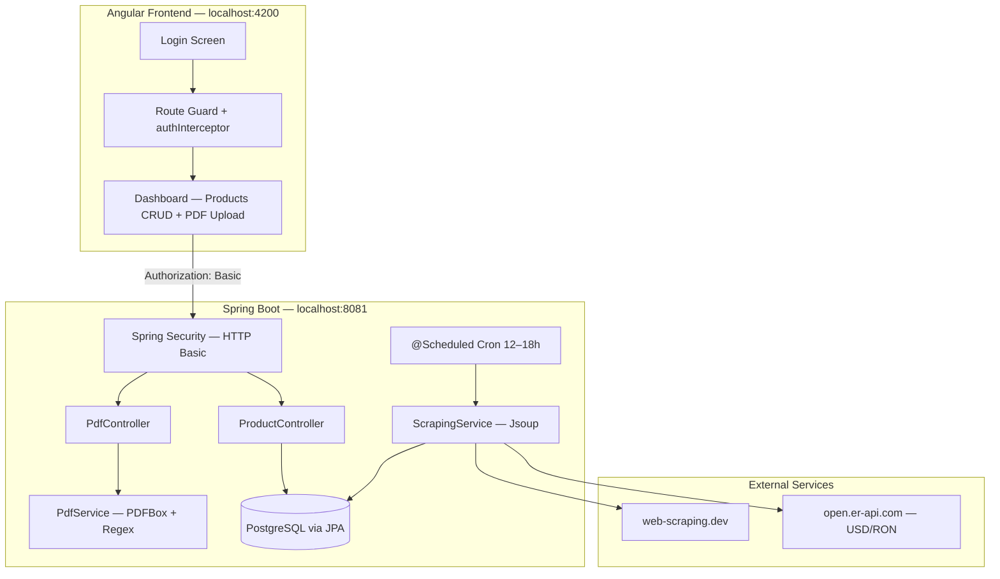

# FullStack Scraping & PDF Parser

A full-stack application that combines **automated web scraping**, **PostgreSQL persistence**, **scheduled background jobs**, and a **regex-driven PDF invoice parser**—exposed through a secured Spring Boot REST API and consumed by a modern **Angular standalone-component** frontend.

| Layer | Technology | Location |
|-------|------------|----------|
| Backend | Spring Boot 4 · Java 17 · Jsoup · PDFBox · OpenCSV | `scraping/` |
| Frontend | Angular 21 · Bootstrap 5 · HTTP Interceptors | `scraping-frontend/` |
| Database | PostgreSQL 15 (Docker) | `scraping/docker-compose.yml` |

---

## Table of Contents

- [Architecture Overview](#architecture-overview)
- [Technical Highlights](#technical-highlights)
  - [Web Scraping with Pagination & Duplicate Filtering](#web-scraping-with-pagination--duplicate-filtering)
  - [Scheduled Cron Jobs (12:00–18:00)](#scheduled-cron-jobs-12001800)
  - [Dynamic PDF Parser (Regex → CSV)](#dynamic-pdf-parser-regex--csv)
  - [PostgreSQL Integration](#postgresql-integration)
  - [API Security (Spring Security · Basic Auth)](#api-security-spring-security--basic-auth)
  - [Angular Frontend](#angular-frontend)
- [API Reference](#api-reference)
- [Prerequisites](#prerequisites)
- [Running Locally](#running-locally)
  - [1. Start PostgreSQL](#1-start-postgresql)
  - [2. Start the Backend](#2-start-the-backend)
  - [3. Start the Frontend](#3-start-the-frontend)
- [Default Credentials](#default-credentials)
- [Project Structure](#project-structure)
- [External Dependencies at Runtime](#external-dependencies-at-runtime)

---

## Architecture Overview



---

## Technical Highlights

### Web Scraping with Pagination & Duplicate Filtering

The backend uses **Jsoup** to authenticate against [web-scraping.dev](https://www.web-scraping.dev), then iterates product listing pages with a **pagination loop** until no more `.product` elements are found.

| Concern | Implementation |
|---------|----------------|
| Authentication | Session cookies via `GET /login` + `POST /api/login` |
| Pagination | `?category=consumables&page={n}` — increments until empty result set |
| Data extraction | CSS selectors: name, image URL, price, description |
| Currency conversion | USD → RON using live rate from Exchange Rate API (fallback `4.60`) |
| Duplicate filtering | **Application layer:** `findByName(name).isEmpty()` before save · **Database layer:** `UNIQUE` constraint on `products.name` |

Scraping is triggered automatically by the scheduler (see below); there is no manual scrape endpoint.

### Scheduled Cron Jobs (12:00–18:00)

`ScrapingService` is annotated with Spring's `@Scheduled` and runs **hourly between 12:00 and 18:00** (inclusive), using the JVM default timezone:

```java
@Scheduled(cron = "0 0 12-18 * * *")
public void performScrapingTask() { ... }
```

| Cron field | Value | Meaning |
|------------|-------|---------|
| Second | `0` | At :00 seconds |
| Minute | `0` | At :00 minutes |
| Hour | `12-18` | Every hour from 12:00 through 18:00 |
| Day / Month / DOW | `* * *` | Every day |

**Execution times:** 12:00, 13:00, 14:00, 15:00, 16:00, 17:00, 18:00 (7 runs per day).

Scheduling is enabled via `@EnableScheduling` on the main application class.

### Dynamic PDF Parser (Regex → CSV)

`PdfService` uses **Apache PDFBox 3** to extract plain text from uploaded invoice PDFs, then applies **two coordinated regex passes** to build structured tabular data exported as **UTF-8 CSV** via OpenCSV.

**Pass 1 — Seller line identifiers**

```regex
Identificator vanzator articol pentru linia (\d+)\s*:(.+)
```

Maps each invoice line number to its product code.

**Pass 2 — Per-line product data (dynamically built)**

For each code/line pair, a multiline regex captures unit price, currency (`RON`/`EUR`), quantity, product name, and validates the line number at end-of-row.

**CSV output columns:** `Cod produs`, `Denumire produs`, `Pret unitar`, `Moneda`, `Cantitate`  
**Download filename:** `produse_extrase.csv`

### PostgreSQL Integration

| Setting | Value |
|---------|-------|
| JDBC URL | `jdbc:postgresql://localhost:5432/scraping_db` |
| Username / Password | `admin` / `password` |
| DDL strategy | `spring.jpa.hibernate.ddl-auto=update` |
| Dialect | `PostgreSQLDialect` |
| Entity table | `products` (id, name, imageUrl, originalPrice, priceRon, description) |

A `docker-compose.yml` in the backend folder provisions **PostgreSQL 15 Alpine** with a persistent volume.

### API Security (Spring Security · Basic Auth)

All REST endpoints require **HTTP Basic Authentication**. CSRF is disabled for API usage; CORS is configured for the Angular dev origin.

| Setting | Value |
|---------|-------|
| Mechanism | HTTP Basic |
| Username | `admin` |
| Password | `autobrand2026` |
| User store | In-memory (`InMemoryUserDetailsManager`) |
| CORS origin | `http://localhost:4200` |
| Allowed methods | GET, POST, PUT, DELETE, OPTIONS |

### Angular Frontend

Built with **Angular 21 standalone components** (no NgModules), the SPA provides:

| Feature | Details |
|---------|---------|
| **Secure login** | Client-side credential check aligned with backend; token stored in `localStorage` |
| **HTTP Interceptor** | Functional `authInterceptor` attaches `Authorization: Basic {token}` to every API call |
| **Route guard** | `authGuard` protects `/dashboard`; unauthenticated users redirect to `/login` |
| **Product management** | Searchable, sortable table with inline edit and delete |
| **PDF upload → CSV download** | `multipart/form-data` upload; response `Blob` triggers browser download of `produse_extrase.csv` |

**Stack:** Angular 21 · RxJS 7 · Bootstrap 5 · TypeScript 5.9

---

## API Reference

Base URL: `http://localhost:8081` — all endpoints require Basic Auth.

### Products — `/api/products`

| Method | Path | Description |
|--------|------|-------------|
| `GET` | `/api/products` | List products (`search`, `sortBy`, `direction` query params) |
| `PUT` | `/api/products/{id}` | Update product |
| `DELETE` | `/api/products/{id}` | Delete product |

### PDF — `/api/pdf`

| Method | Path | Description |
|--------|------|-------------|
| `POST` | `/api/pdf/upload` | Upload PDF (`file` field) → returns CSV attachment |

---

## Prerequisites

| Tool | Version | Purpose |
|------|---------|---------|
| **Java JDK** | 17+ | Spring Boot backend |
| **Maven** | 3.6+ (or use included `mvnw`) | Build & run backend |
| **Node.js** | 18+ recommended | Angular frontend |
| **npm** | 9+ | Frontend dependencies |
| **Docker** | Latest | PostgreSQL via Compose (optional if you run Postgres manually) |

---

## Running Locally

### 1. Start PostgreSQL

From the backend directory:

```bash
cd scraping
docker compose up -d
```

Verify the container is healthy and listening on port **5432**.

Alternatively, run your own PostgreSQL instance with database `scraping_db`, user `admin`, password `password`.

### 2. Start the Backend

**Windows (PowerShell / CMD):**

```bash
cd scraping
.\mvnw.cmd spring-boot:run
```

**macOS / Linux:**

```bash
cd scraping
./mvnw spring-boot:run
```

The API will be available at **http://localhost:8081**.

**Build JAR (optional):**

```bash
.\mvnw.cmd clean package
java -jar target\scraping-0.0.1-SNAPSHOT.jar
```

### 3. Start the Frontend

```bash
cd scraping-frontend
npm install
npm start
```

Open **http://localhost:4200** — you will be redirected to the login screen.

> **Note:** The frontend calls `http://localhost:8081` directly (no dev proxy). Ensure the backend is running and CORS is enabled before testing API features.

**Production build (optional):**

```bash
npm run build
```

**SSR mode (optional):**

```bash
npm run build
npm run serve:ssr:scraping-frontend
```

Serves on port **4000** (or `PORT` environment variable).

---

## Default Credentials

Use the same credentials for the Angular login screen and API Basic Auth:

| Field | Value |
|-------|-------|
| Username | `admin` |
| Password | `autobrand2026` |

---

## Project Structure

```
FullStackScrapingProject/
├── README.md
├── scraping/                          # Spring Boot backend
│   ├── pom.xml
│   ├── docker-compose.yml
│   └── src/main/java/com/example/scraping/
│       ├── ScrapingApplication.java   # @EnableScheduling
│       ├── config/SecurityConfig.java
│       ├── controller/
│       │   ├── ProductController.java
│       │   └── PdfController.java
│       ├── entity/Product.java
│       ├── repository/ProductRepository.java
│       └── service/
│           ├── ScrapingService.java   # Cron + Jsoup pagination
│           ├── PdfService.java        # PDFBox + Regex → CSV
│           └── ExchangeRateService.java
└── scraping-frontend/                 # Angular 21 frontend
    ├── package.json
    ├── angular.json
    └── src/app/
        ├── app.config.ts              # HTTP client + interceptor
        ├── app.routes.ts              # authGuard
        ├── components/
        │   ├── login.component.ts
        │   └── dashboard/
        └── services/
            ├── auth.service.ts
            ├── auth.interceptor.ts
            └── product.service.ts
```

---

## External Dependencies at Runtime

| Service | URL | Used by |
|---------|-----|---------|
| Web scraping target | `https://www.web-scraping.dev` | Scheduled scraper |
| Exchange rate API | `https://open.er-api.com/v6/latest/USD` | USD → RON conversion |

Both require outbound network access when the scraper runs.

---

## Backend Dependencies (Maven)

| Library | Version | Role |
|---------|---------|------|
| Spring Boot | 4.0.6 | Framework |
| Jsoup | 1.17.2 | HTML parsing & scraping |
| Apache PDFBox | 3.0.2 | PDF text extraction |
| OpenCSV | 5.9 | CSV generation |
| PostgreSQL Driver | (managed) | JDBC connectivity |
| Spring Security | (managed) | Basic authentication |

---

## License

This project is provided as a portfolio / demonstration implementation. Adjust credentials and secrets before deploying to any shared or production environment.
